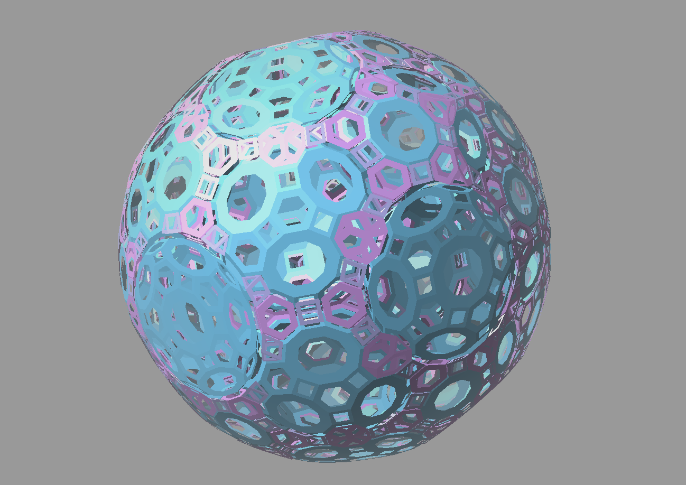

# gl4dw

`gl4dw` is a legacy OpenGL viewer for 4D polytopes. The original code and
polytope data have been refreshed enough to build with CMake on Windows, MacOS and
Linux/WSL while preserving the small, direct structure of the old program.

The viewer loads polytope data from `data/`, projects it into 3D, and displays
it with GLUT/OpenGL. The repository also includes smoke tests and data
validation tests that can run without opening a viewer window.



## Repository Layout

- `assets/` - screenshots and other repository media
- `src/` - C++ implementation files
- `include/` - project headers and compatibility wrappers
- `tests/` - smoke tests and data validation tests
- `data/` - bundled polytope datasets
- `config/` - example viewer configuration

## Requirements

Required for all builds:

- CMake 3.20 or newer
- A C++17 compiler
- nlohmann-json

Required for the viewer:

- OpenGL
- GLUT or freeglut

On Windows, dependencies are declared in `vcpkg.json`. On macOS, install the
user-space dependencies with Homebrew:

```bash
brew install cmake nlohmann-json
```

OpenGL and GLUT are provided by macOS, but Apple marks those APIs as deprecated.
The viewer can still build, though macOS may print OpenGL/GLUT deprecation
warnings during compilation.

On Ubuntu/WSL, install the system packages:

```bash
sudo apt update
sudo apt install cmake ninja-build g++ nlohmann-json3-dev freeglut3-dev
```

## Building on Windows

Open a Visual Studio Developer Command Prompt, then configure, build, and test:

```bat
cmake -S . -B build
cmake --build build --config Release
ctest --test-dir build -C Release --output-on-failure
```

If you use vcpkg manually, pass its toolchain file when configuring:

```bat
cmake -S . -B build -DCMAKE_TOOLCHAIN_FILE=%VCPKG_ROOT%\scripts\buildsystems\vcpkg.cmake
```

## Building on Linux/WSL

Build the core library and tests without the OpenGL viewer:

```bash
cmake -S . -B build-core -G Ninja -DGL4DW_BUILD_VIEWER=OFF
cmake --build build-core
ctest --test-dir build-core --output-on-failure
```

Build the viewer as well:

```bash
cmake -S . -B build-viewer -G Ninja -DGL4DW_BUILD_VIEWER=ON
cmake --build build-viewer
ctest --test-dir build-viewer --output-on-failure
```

## Building on macOS

Build the core library and tests without opening a viewer window:

```bash
cmake -S . -B build-core-mac -DGL4DW_BUILD_VIEWER=OFF
cmake --build build-core-mac
ctest --test-dir build-core-mac --output-on-failure
```

Build the viewer as well:

```bash
cmake -S . -B build-viewer-mac -DGL4DW_BUILD_VIEWER=ON
cmake --build build-viewer-mac
ctest --test-dir build-viewer-mac --output-on-failure
```

If you prefer Ninja and have it installed, add `-G Ninja` to the configure
commands. Without Ninja, CMake's default macOS generator works.

## Manual Install

There is no CMake install target. To keep installation simple and user-local,
copy the viewer executable and bundled data into a directory under your home
directory.

Windows example:

```bat
mkdir "%USERPROFILE%\gl4dw"
copy build\Release\gl4dw.exe "%USERPROFILE%\gl4dw\"
xcopy data "%USERPROFILE%\gl4dw\data\" /E /I
xcopy config "%USERPROFILE%\gl4dw\config\" /E /I
```

For single-configuration generators, the executable may be `build\gl4dw.exe`
instead. For Debug builds, it may be `build\Debug\gl4dw.exe`.

If the viewer does not start because the freeglut DLL is missing, copy
`freeglut.dll` or `freeglutd.dll` from the build directory or vcpkg installed
tree into the same directory as `gl4dw.exe`.

Linux/WSL example:

```bash
mkdir -p "$HOME/gl4dw"
cp ./build-viewer/gl4dw "$HOME/gl4dw/"
cp -R data "$HOME/gl4dw/"
cp -R config "$HOME/gl4dw/"
```

Run the installed copy from that directory so the default `data` path resolves:

```bash
cd "$HOME/gl4dw"
./gl4dw c8
```

On Windows, run:

```bat
cd /d "%USERPROFILE%\gl4dw"
gl4dw.exe c8
```

If you want to run the executable from another working directory, copy
`config\gl4d.json.example` to `gl4d.json` and set `dataDir` to the full path of
the copied `data` directory.

## Build Targets

The core library target is:

- `gl4dw_core`

Test executables:

- `gl4dw_smoke`
- `gl4dw_config_smoke`
- `gl4dw_data_smoke`
- `gl4dw_data_validation`
- `gl4dw_readpolytope_failure`

Viewer executable:

- `gl4dw`

`ReadPolytope` lives in `src/polytope_loader.cpp`, so the data loading tests do
not require OpenGL or GLUT.

## Running the Viewer

The default data directory is `data`, and the default polytope name is `c8`.
You can also pass a polytope name on the command line.

Windows:

```bat
build\Release\gl4dw.exe c8
```

With a single-configuration generator, use `build\gl4dw.exe c8` instead.

Linux/WSL:

```bash
./build-viewer/gl4dw c8
```

If WSLg does not show GUI windows, restart WSL from Windows:

```powershell
wsl --shutdown
```

Then reopen WSL and run the viewer again. If OpenGL acceleration is unreliable,
try software rendering:

```bash
LIBGL_ALWAYS_SOFTWARE=1 ./build-viewer/gl4dw c8
```

The program writes startup progress to `gl4dw.log`.

## Command Line Options

Usage:

```bash
gl4dw [options] [polytope-name]
```

If `polytope-name` is omitted, the viewer opens `c8`. The name is resolved
against the configured data directory without an extension, so `c8` loads
`data/c8.poi`.

Options:

- `-h` - draw facets as hollow frames.
- `-s` - draw facets as solid surfaces. This is the default.
- `-c` - enable the extra clipping plane.
- `-n <title>` - set the GLUT window title.

Examples:

```bash
./build-viewer/gl4dw c24
./build-viewer/gl4dw -h c8
./build-viewer/gl4dw -c -n "gl4dw c8 clipped" c8
```

## Configuration

Optional viewer settings can be stored in `gl4d.json` in the project root. See
`config/gl4d.json.example` for the supported keys.

Example:

```json
{
  "dataDir": "data",
  "width": 800,
  "extendRate": 0.06,
  "clip": false,
  "clipPlane": [1.0, -1.0, -1.0, 0.0],
  "hidePoly": 0,
  "fillType": 0
}
```

## Controls

- Drag with the left mouse button to rotate in one set of 4D planes.
- Drag with another mouse button to rotate in the alternate planes.
- After releasing the mouse, the polytope keeps spinning.
- Press `q`, `Q`, or `Esc` to exit.

## License

The source code and bundled polytope data are original work by Satoshi
Yamaguchi.

This project, including the source code and bundled polytope data, is licensed
under the BSD Zero Clause License (`0BSD`). See `LICENSE` for details.
